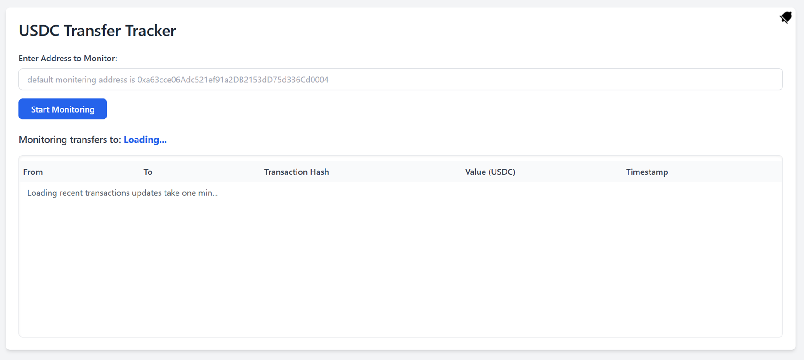
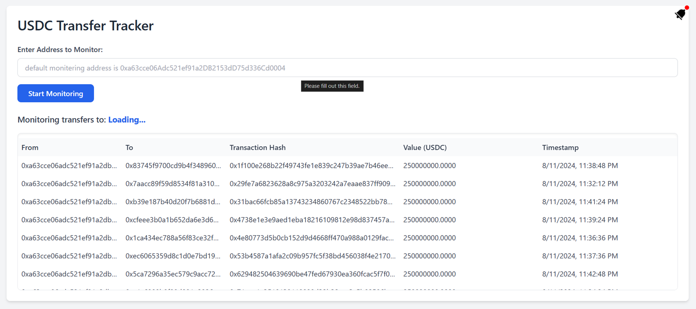
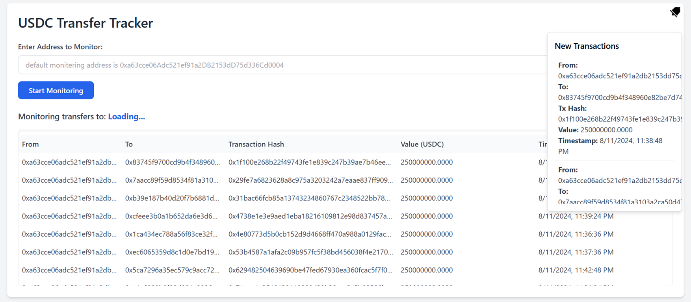
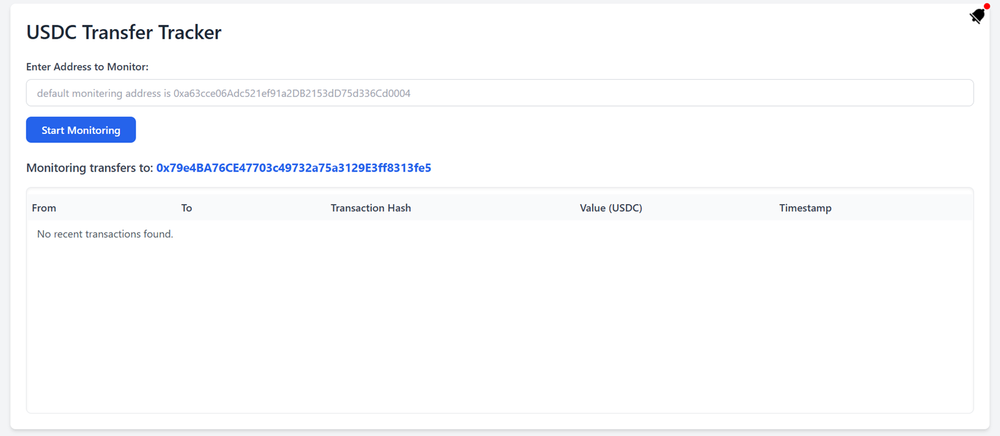

# Notification Bot for Tracking USDC Transfers to a Specific Address

This is a bot that tracks the usdc transfers to a specific address on the sepolia testnet. the main working of this project is that users can submit the account they wants to monitor and they monitor the account transfers time to time and they recieve notifications for the latest transfers done on that network.

## Project Working

1.Below is the user Interface of the USDC Transfer Tracer.


2.The default account to be monitored is fixed and the default account that is monitored is 0xa63cce06Adc521ef91a2DB2153dD75d336Cd0004


3.The notification button on the top right notifies the new transactions of transfer on the accouunt.


4.Users can submit their account that they want to monitor and the monitoring will to their desired account.


## Features

1.Real-time USDC Transfer Tracking: Track USDC token transfers to a specific address using The Graph Protocol, with automatic updates without needing to refresh the page.

2.Custom Address Monitoring: Users can enter and track transfers for any Ethereum address by submitting it through a simple form.

3.Push Notifications: A notification icon appears when new transfers are detected. Clicking it shows the latest transaction or a message if no new transactions are found.

4.WebSocket Updates: Real-time updates are sent to the frontend through WebSockets, ensuring the UI is always current without excessive network requests.

5.Backend Integration: The backend fetches transaction data from a GraphQL API, using Express.js and WebSockets to push real-time updates to the frontend.

6.Responsive Frontend: Used EJS templetingwhich is well suidted for simplicity with express I styled it with TailwindCSS, displaying transaction details with automatic updates. The UI handles loading and empty states smoothly.

## GaphgQl Subgraph setting for Graphql responces of the sepolia testnet address transfer monetoring:-

To start the project we must create a subgraph to get the notification and all from time to time subgraph is noting but it has a unique process of syncting the actual data of deployed contracts one and then and we will qurey this subgraph and get or implement a mechanism of pushing the notification timely to user.

## **Setting Up the Subgraph**

1. Install Graph CLI: First, install the Graph CLI globally on your system:

```bash
npm install -g @graphprotocol/graph-cli
```

2. Create a New Directory for the Subgraph
   Create a directory where you want to initialize the subgraph:

```bash
mkdir usdc-transfer-subgraph
cd usdc-transfer-subgraph
```

3. Initialize the Subgraph

```bash
graph init
```

4. Select Ethereum Network When prompted:

```bash
Choose Ethereum: 1
```

5. Subgraph Slug Creation:-Go to The Graph Studio and create a new subgraph. After creating the subgraph, copy the slug from the URL and paste it when prompted:

```bash
Subgraph slug: notification-bot-for-tracking-usdc-transfers
```

6. Select Ethereum Network: Sepolia Testnet Choose Sepolia when prompted for the network:

```bash
Network: sepolia testnet
```

7. Provide Contract Address and ABI Enter the USDC contract address when prompted and then Graph will automatically detect the ABI and proceed.

```bash
Contract address: 0x94a9d9ac8a22534e3faca9f4e7f2e2cf85d5e4c8
```

8. Set the Start Block Number Set the start block number for tracking USDC transfers:

```bash
Start block: 3975332
```

After this, the necessary files and configurations will be automatically created in your subgraph directory.

9. If prompted for the graphql's subgraph for version select v0.0.1;

10. Deploy the Subgraph Deploy the subgraph to The Graph network:

```bash
graph deploy --studio notification-bot-for-tracking-usdc-transfers

```

---

After the deployement just navigate to the subgraph studio. for example the subgraph i create the url looks like https://thegraph.com/studio/subgraph/notification-bot-for-tracking-usdc-transfers-to-a-specific-address/
and the graphqul enpoint lookes like this:
https://api.studio.thegraph.com/query/94108/notification-bot-for-tracking-usdc-transfers-to-a-specific-address/v0.0.1

---

#Developer Details:-

1. Name : - SHAIK FIROZ
2. Number : - 8333886963
3. emails :- [ firozshaik.ce.10@gmail.com , firozshaik862@gmail.com, firoz.21bce9396@vitapstudent.ac.in]
4. University:-- VIT-AP Amaravati
5. College Reg no :- 21bce9396
6. Interests : Blockchain technology Enthusisat, MERN full stack web development
7. Address :- Vijayawada, Andhra Pradesh 520015.
